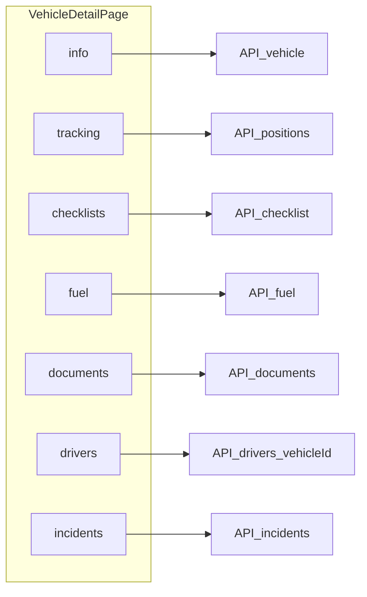

# Abas relacionadas na tela do veículo

## Contexto atual

- A página principal do veículo já usa `Tabs` com **Informações** e **Rastreamento** em [`apps/web/app/dashboard/vehicles/[vehicleId]/page.tsx`](apps/web/app/dashboard/vehicles/[vehicleId]/page.tsx).
- Documentos do veículo hoje vivem numa rota separada: [`apps/web/app/dashboard/vehicles/[vehicleId]/documents/page.tsx`](apps/web/app/dashboard/vehicles/[vehicleId]/documents/page.tsx) (lista + `DocumentFormDialog` + exclusão).
## Regra: filtro por veículo no backend

Tudo o que for listado no contexto de um veículo deve vir **já filtrado pelo servidor** (`vehicleId` na query Prisma ou join equivalente). O frontend na aba do veículo **não** deve carregar listagens completas da organização para filtrar em memória.

Estado das APIs:

- **Checklist** — já aplica `vehicleId` em [`checklist.service.ts`](apps/api/src/checklist/checklist.service.ts) (`where.vehicleId`).
- **Combustível** — já aceita `vehicleId` em listagem ([`fuel.service.ts`](apps/api/src/fuel/fuel.service.ts)); datas opcionais.
- **Documentos** — já aplica `vehicleId` em [`documents.service.ts`](apps/api/src/documents/documents.service.ts).
- **Ocorrências** — já expõe `vehicleId` na listagem ([`incidentsAPI.list`](apps/web/lib/frontend/api-client.ts)); confirmar no serviço que o filtro chega ao `where` (ajustar se necessário).
- **Motoristas** — **a implementar**: hoje [`GET .../drivers`](apps/api/src/drivers/drivers.controller.ts) não aceita `vehicleId`. Incluir parâmetro opcional `vehicleId` na listagem (recomendado) **ou** `GET .../vehicles/:vehicleId/drivers` no módulo de veículos, desde que a query seja do tipo: motoristas com `vehicleAssignments` ativos (`endDate: null`) para esse veículo, com validação de que o veículo pertence à organização e respeito ao mesmo critério de acesso a `customer` que `list` já usa ([`drivers.service.ts`](apps/api/src/drivers/drivers.service.ts)). Resposta pode manter o mesmo `DriverResponseDto[]` (incluindo assignments) ou apenas os vínculos desse veículo, conforme o que for mais simples para a tabela na aba.

Atualizar [`driversAPI.list`](apps/web/lib/frontend/api-client.ts) para enviar `vehicleId` quando presente.

## Abordagem de UI/UX

1. **Novas abas** (rótulos em PT via `vehicles.tabs.*` em [`apps/web/i18n/locales/pt.json`](apps/web/i18n/locales/pt.json)): Checklists, Abastecimentos, Documentos, Motoristas, Ocorrências — mantendo as duas abas atuais no início.
2. **Permissões**: mostrar cada `TabsTrigger` só se `can(Module.X, Action.VIEW)` for verdadeiro para `CHECKLIST`, `FUEL`, `DOCUMENTS`, `DRIVERS`, `INCIDENTS` ([`use-permissions.ts`](apps/web/lib/hooks/use-permissions.ts)). Se nenhuma aba extra for visível, o layout permanece só com Informações/Rastreamento.
3. **Performance**: carregar dados de cada aba **quando o utilizador a seleciona** (estado `activeTab` + `useEffect` por aba ou um hook pequeno por painel), em vez de disparar todas as chamadas ao abrir o veículo.
4. **Lista de tabs**: com ~7 itens, remover o `max-w-md` restritivo e usar **lista horizontal com scroll** (`overflow-x-auto`, `flex-nowrap`, triggers `shrink-0`) para não quebrar em viewports estreitas — mesmo padrão visual (underline) já usado.
5. **Reutilização de código** (evitar um `page.tsx` gigante):
   - Extrair painéis para algo como `apps/web/app/dashboard/vehicles/[vehicleId]/tabs/` (ex.: `vehicle-documents-tab.tsx`, `vehicle-fuel-tab.tsx`, …) ou um único ficheiro por domínio, conforme preferência na implementação.
   - **Documentos**: extrair a lógica/UI da página `documents/page.tsx` para um componente partilhado (ex. `VehicleDocumentsTab`) consumido pela nova aba; a rota [`documents/page.tsx`](apps/web/app/dashboard/vehicles/[vehicleId]/documents/page.tsx) passa a renderizar esse componente (opcionalmente com cabeçalho mínimo + “voltar”) para não duplicar nem quebrar links antigos.
6. **Tabelas e ações**:
   - Reutilizar `DataTable` + funções de colunas já existentes onde for trivial: [`getFuelColumns`](apps/web/app/dashboard/fuel/components/fuel-columns.tsx), [`getIncidentColumns`](apps/web/app/dashboard/incidents/columns.tsx) — ações de linha podem simplificar-se (ex.: só “Ver detalhes” com `Link` para `/dashboard/incidents/[id]` e `/dashboard/checklist/entries/[id]`).
   - Combustível: opcionalmente reutilizar [`FuelFormDrawer`](apps/web/app/dashboard/fuel/components/fuel-form-drawer.tsx) na aba com **veículo pré-preenchido** (pequena extensão: prop opcional `defaultVehicleId` quando `log` é null), mais botão “Novo” se `can(FUEL, CREATE)`.
   - Ocorrências: formulário/drawer global pode ser pesado; MVP aceitável = tabela filtrada + link “Nova ocorrência” para [`/dashboard/incidents`](apps/web/app/dashboard/incidents) (utilizador escolhe o veículo) **ou** reutilizar o componente de criação existente na lista de ocorrências se for fácil passar `defaultVehicleId` — a decisão final na implementação: priorizar **lista + ver/editar** na aba; criação inline só se já houver componente reutilizável com pouco acoplamento.
7. **Deep link (opcional mas baixo custo)**: sincronizar `activeTab` com `?tab=` via `useSearchParams` / `router.replace` para URLs como `/dashboard/vehicles/[id]?tab=documents` e permitir que a rota legacy `/documents` redirecione para `?tab=documents`.

## Ficheiros principais a tocar

- **API motoristas + veículo**: [`apps/api/src/drivers/drivers.controller.ts`](apps/api/src/drivers/drivers.controller.ts), [`apps/api/src/drivers/drivers.service.ts`](apps/api/src/drivers/drivers.service.ts), DTOs/Swagger se necessário; testes unitários ou e2e mínimos para o filtro.
- [`apps/web/lib/frontend/api-client.ts`](apps/web/lib/frontend/api-client.ts) — `driversAPI.list(..., { vehicleId })`.
- [`apps/web/app/dashboard/vehicles/[vehicleId]/page.tsx`](apps/web/app/dashboard/vehicles/[vehicleId]/page.tsx) — novas abas, estado ativo, permissões.
- [`apps/web/app/dashboard/vehicles/[vehicleId]/documents/page.tsx`](apps/web/app/dashboard/vehicles/[vehicleId]/documents/page.tsx) — delegar ao componente partilhado.
- Novos componentes sob `apps/web/app/dashboard/vehicles/[vehicleId]/` (pasta `tabs/` ou similar).
- [`apps/web/i18n/locales/pt.json`](apps/web/i18n/locales/pt.json) — chaves `vehicles.tabs.*` e mensagens curtas de vazio (“Nenhum … para este veículo”).
- Opcional: [`apps/web/app/dashboard/fuel/components/fuel-form-drawer.tsx`](apps/web/app/dashboard/fuel/components/fuel-form-drawer.tsx) — `defaultVehicleId` para melhor UX na aba.

## Critérios de pronto

- Na ficha do veículo, com permissões adequadas, é possível percorrer abas e ver listas corretas; **cada pedido de listagem envia `vehicleId` e o resultado já vem restrito a esse veículo** (sem filtro exclusivamente no cliente).
- Aba Motoristas usa o novo contrato da API (nunca `driversAPI.list` sem filtro seguido de `.filter` em JS).
- Rota `/dashboard/vehicles/:id/documents` continua funcional (via componente partilhado ou redirect).
- Sem regressões nas abas Informações e Rastreamento.
